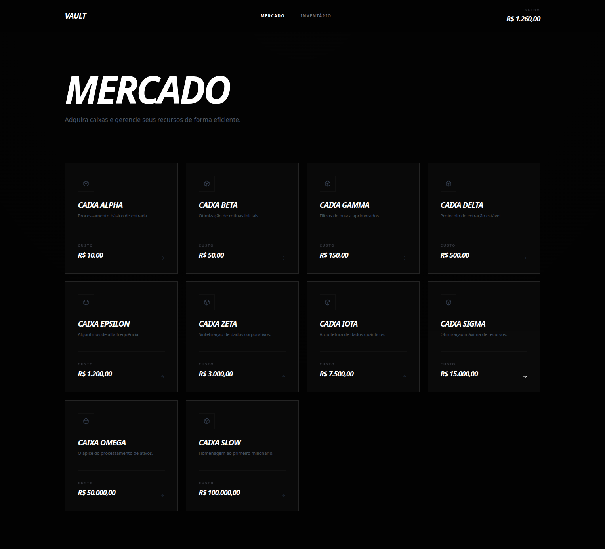

# Simulador de Caixas

Este é um projeto simples de simulação de abertura de caixas. O objetivo é comprar caixas, ganhar itens de diferentes raridades e gerenciar o seu saldo.

## 🕹️ Como funciona

-   **Mercado:** Você escolhe e compra diferentes tipos de caixas.
-   **Abertura:** Existe uma animação de roleta para revelar o item ganho.
-   **Venda:** Você pode vender seus itens para recuperar dinheiro e continuar jogando.
-   **Lotes:** É possível abrir até 10 caixas ao mesmo tempo.

---

## 🎲 Chances e Valores

Cada item tem uma raridade. Quanto mais difícil de sair, mais ele vale:

| Nível        | Chance | Valor        |
| ------------ | ------ | ------------ |
| **Comum**    | 75%    | 0.4x o custo |
| **Incomum**  | 18%    | 1.2x o custo |
| **Raro**     | 5%     | 3.5x o custo |
| **Épico**    | 1.5%   | 12x o custo  |
| **Relíquia** | 0.5%   | 45x o custo  |

---

## 🛠️ Tecnologias usadas

-   **Nuxt 3**
-   **TypeScript**
-   **Tailwind CSS**
