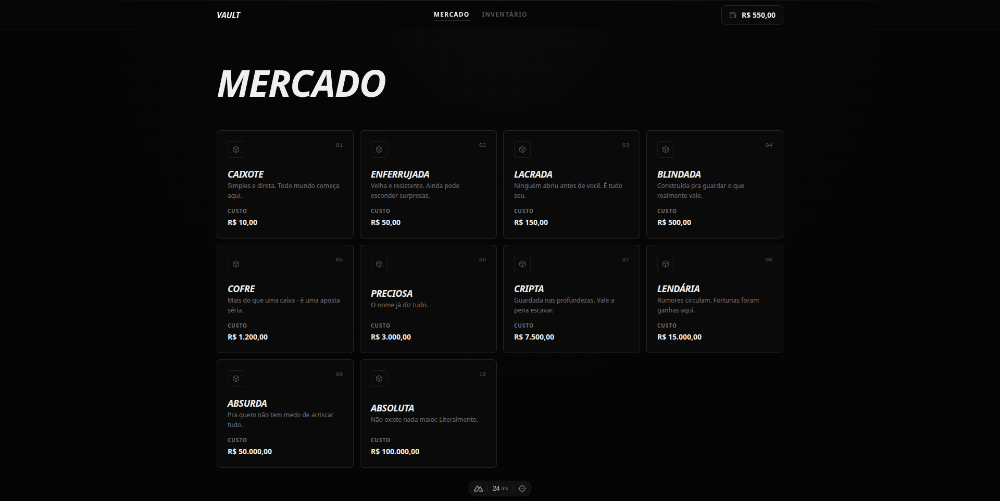

# Vault

Simulador de abertura de caixas (case opening). O projeto permite comprar caixas, abrir multiplas unidades por rodada, visualizar animacao de roleta e gerenciar itens no inventario.



## Visao geral

- Mercado com varias caixas e custos progressivos
- Abertura em lote (1, 2, 3, 5 e 10 unidades)
- Sistema de raridade com chances e multiplicadores por nivel
- Animacao de roleta para revelar os itens obtidos
- Inventario com filtros por raridade e venda individual/em massa
- Controle de saldo em tempo real

## Stack

- `Nuxt 4`
- `Vue 3`
- `Tailwind CSS`
- `@nuxt/icon`
- `TypeScript`

## Requisitos

- Node.js 20+ (recomendado LTS)
- npm (ou outro gerenciador compativel)

## Instalacao

```bash
npm install
```

## Desenvolvimento

Inicie o servidor local em `http://localhost:3000`:

```bash
npm run dev
```

## Build e preview

Gerar build de producao:

```bash
npm run build
```

Visualizar build localmente:

```bash
npm run preview
```

Gerar versao estatica:

```bash
npm run generate
```

## Scripts

- `npm run dev`: ambiente de desenvolvimento
- `npm run build`: build de producao
- `npm run preview`: preview da build
- `npm run generate`: geracao estatica

## Observacoes

- Saldo inicial padrao: `1000`.
- O valor do item recebido depende da raridade sorteada.
- Os itens podem ser vendidos individualmente ou por filtro de raridade.
