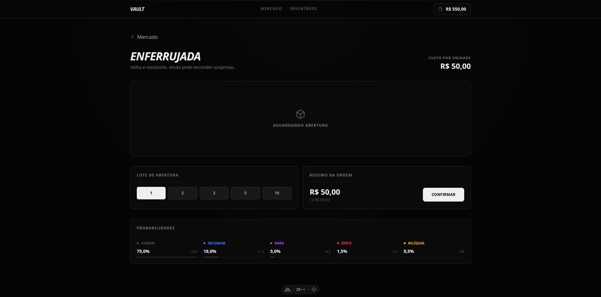
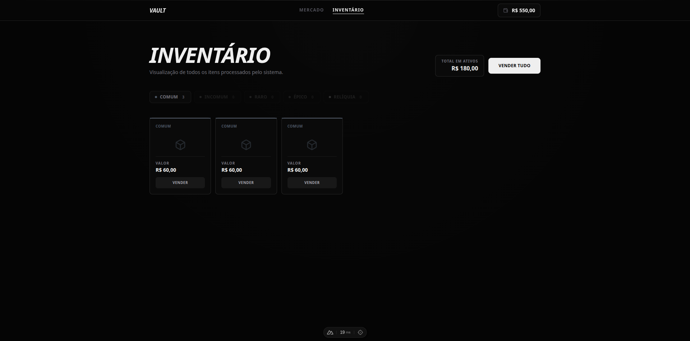

<div align="center">
  
  
  
</div>

---

## Sobre

Vault é um simulador de abertura de caixas. Você começa com um saldo, compra caixas no mercado e as abre para ganhar itens. Cada item tem uma raridade que define seu valor. Venda o que não precisar e continue jogando.

---

## O que dá pra fazer

- Comprar caixas de diferentes preços no mercado
- Abrir de 1 a 10 caixas de uma vez com animação de roleta
- Ver todos os itens que você ganhou no inventário
- Vender itens para recuperar saldo

---

## Raridades

| Raridade     | Cor      | Chance | Valor         |
| ------------ | -------- | :----: | :-----------: |
| Comum        | Cinza    | 75%    | 0.4x o custo  |
| Incomum      | Azul     | 18%    | 1.2x o custo  |
| Raro         | Roxo     | 5%     | 3.5x o custo  |
| Épico        | Vermelho | 1.5%   | 12x o custo   |
| Relíquia     | Dourado  | 0.5%   | 45x o custo   |

---

## Caixas

| Caixa       | Preço      |
| ----------- | ---------- |
| Caixote     | R$ 10      |
| Enferrujada | R$ 50      |
| Lacrada     | R$ 150     |
| Blindada    | R$ 500     |
| Cofre       | R$ 1.200   |
| Preciosa    | R$ 3.000   |
| Cripta      | R$ 7.500   |
| Lendária    | R$ 15.000  |
| Absurda     | R$ 50.000  |
| Absoluta    | R$ 100.000 |

---

## Tecnologias

- **Nuxt** com Vue 3 e TypeScript
- **Tailwind CSS** para estilização
- **@nuxt/icon** com ícones Lucide

---

## Como rodar

```bash
npm install
npm run dev
```

Acesse em `http://localhost:3000`.
